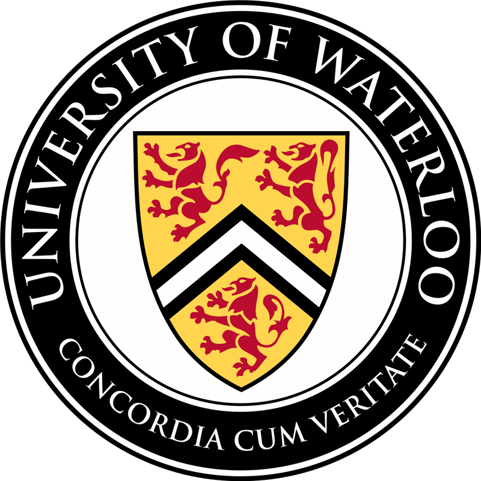

### PhD in Systems Design Engineering

*Expected* August 2025, University of Waterloo, *GPA --* 
**Supervisor**: Dr. Kerstin Dautenhahn  
**Received** the Engineering Excellence Fellowship (PhD).

---

### MASc in Systems Design Engineering

 

August 2021, University of Waterloo, *GPA -- 89.25%* 
**Thesis**: "[Accessible Integration of Physiological Adaptation in Human-Robot Interaction](https://uwspace.uwaterloo.ca/handle/10012/17462)" 
**Supervisor**: Dr. Kerstin Dautenhahn 
**Received** a Microsoft AI for Social Good research grant.

---

### BSc in Computer Science 

April 2019, University of Lethbridge, *GPA -- 80.75%* 
Graduated with Co-operative Education  
**Exchange term** at the Italian Institute of Technology (Genoa, Italy)  
**Received** funding from NSERC USRA, Mitacs Globalink, and Chinook awards for research projects.
