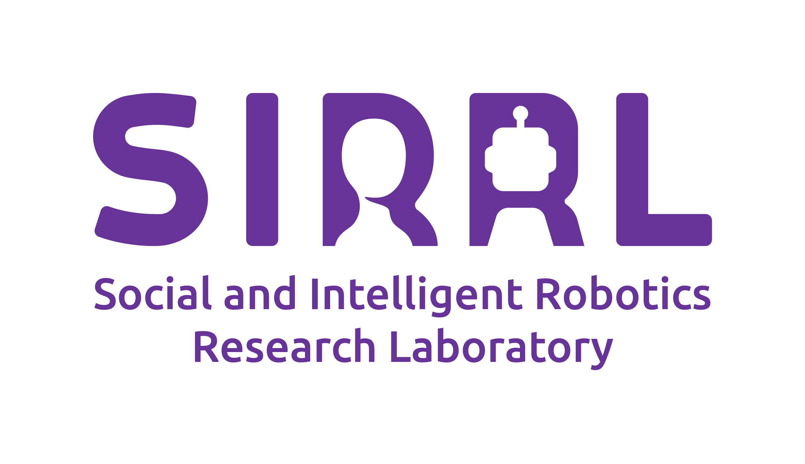

Hi! I’m Austin Kothig, a social robotics researcher
===

I am a **PhD student** in the department of **Systems Design Engineering** at the **University of Waterloo**, advised by **Kerstin Dautenhahn**. I am affiliated with the **Social and Intelligent Robotics Research Lab (SIRRL)**. 

 

My main research interests are in human-robot interaction, embodied social agents, cognitive interaction, expressive behaviour, and artificial intelligence.

Here you can find preprints of my publications, overviews of past and ongoing projects, and my contact information.
